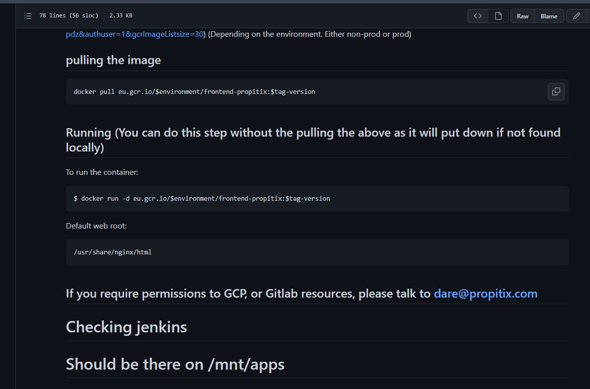

## TOOLING WEBSITE DEPLOYMENT AUTOMATION WITH CONTINUOUS INTEGRATION. INTRODUCTION TO JENKINS

This project aims to enhance the architecture prepared in Project 8 by adding a Jenkins server, configure a job to automatically deploy source codes changes from Git to NFS server. 

I created an AWS EC2 instance based on Ubuntu Server 20.04 and named it **Jenkins** and I opened up the TCP port 8080 by creating a new inbound rule in the EC2 security group on the server.

I installed JDK and Jenkins and confirmed Jenkins is up and running.

I configured jenkins via the web browser.

I enabled webhook in my Github repository settings.

I clicked on new item and created a freestlye project on jenkins. Afterwards I connected my github repository and inputted the url. 

I tested it and it reflected.

I  configured the process of triggering the job from github webhook.

I saw that the new build has been launched automatically by webhook and the results- artefact has been saved on jenkins server.

After configuring the build, I clicked build now

I made changes in the readme.md file in the Github repository and pushed the changes into the master branch and the build was automatically launched and the result artifacts saved on jenkins server.

I connected to my NFS server and and checked readme.md file to check if the /mnt/apps has been updated.

While this is the equivalent output of the readme.md on github. 

The new information I added to the read,e file is "Should be there on /mnt/apps".

